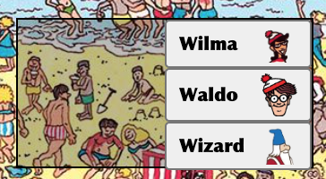
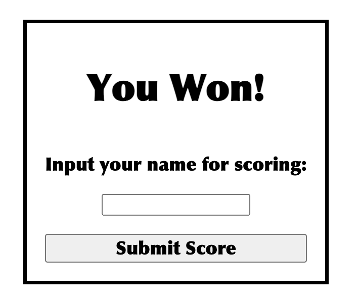

# Where's Waldo
The goal of this project was to create a Where's Waldo game app. I decided to use a REST APIs in Node.js using Express, PostgreSQL, and Prisma for the backend and React for the frontend.

## Features
1. Single page app that autoloads the map, map characters, and all time highscores.


2. Shows a startup page if a game has not been started yet with a create new game button.
3. Once a game has been launched, it loads the image and event handlers for selecting a point on the screen.


4. The selection box has the names of the characters you are trying to find and when clicked searches the database to see if that character has been found.


5. If the character has not been found, it then compares the x and y values of the selected point (with additional hitbox padding) to see if the character's coordinates are within the bounds of the selection box.
6. If the character's coordinates are in the selection box it will add that character and game id to a found characters join table that is then read by the frontend to determine if the win condition is met.


7. Once the win condition of having as many found characters as there are characters in the map, it will load the end game form.


8. Using the end game form, players can input their name and it will update that game id in the game table with the new name and game duration for high score calculation.


## Installation

Before installing, ensure you have the following software installed:
**Git**: [Download Git](https://git-scm.com)
**Node.js**: [Download Node.js](https://nodejs.org)
**postSQL**: [Download postSQL](https://www.postgresql.org/)

1. **Clone the repository**
```git clone https://github.com/thall34/wheres-waldo```
2. **Navigate to the project directory**
```cd clone-location/wheres-waldo```
3. **Install dependencies**
```cd ./frontend -> npm install -> cd ../backend -> npm install```
4. **Configure .env file in backend folder and add a DATABASE_URL variable**
```DATABASE_URL=postgresql://<your-role-name>:<your-role-password>@localhost:5432/waldo?schema=public```
5. **Add beach and racetrack picture to your cloudinary account**
```/wheres-waldo/frontend/public/waldo-beach & /wheres-waldo/frontend/public/waldo-racetrack```
6. **Add CLOUDINARY variables to your backend .env file**
```CLOUDINARY_CLOUD_NAME=<your-cloud-name>  CLOUDINARY_API_KEY=<your-api-key>  CLOUDINARY_API_SECRET=<your-api-secret>```
7. **Add CLOUDINARY MAP variables to your backend .env file**
```CLOUD_PATH_MAP1=<your-beach-image-url> CLOUD_ID_MAP1=<your-beach-image-filename> CLOUD_PATH_MAP2=<your-racetrack-image-url> CLOUD_ID_MAP2=<your-racetrack-image-filename>```
8. **Run seed script to populate your database**
```cd ./backend node config/seed.js```
9. **Configure .env file in frontend folder and add VITE_API_URL variable**
```VITE_API_URL=<your-backend-port>```
10. **Start the local server**
```cd backend -> node app.js```
11. **Start the React server**
```cd frontend -> node config/seed.js```
12. **Navigate to the localhost in your browser**
```http://localhost:5173```

## Future improvements

More maps